# The AeroFleet Deployment Process

When discussing this architecture in an interview, you want to emphasize **automation**, **security**, and **immutability**. 

Here is the step-by-step breakdown of how the Continuous Integration and Continuous Deployment (CI/CD) pipeline works for this application.

## High-Level Architecture Flow

```mermaid
sequenceDiagram
    participant Dev as Developer
    participant Git as GitHub (Repo)
    participant CI as GitHub Actions (CI/CD)
    participant GHCR as GitHub Container Registry
    participant Server as Production Server (AWS/Azure)

    Dev->>Git: 1. Push code to `main` branch
    Git->>CI: 2. Trigger Workflow (main.yml)
    
    rect rgb(20, 30, 40)
        Note over CI: Stage 1: Build & Lint
        CI->>CI: Checkout Code
        CI->>CI: `npm ci` (Install Dependencies)
        CI->>CI: `npm run lint` (Code Quality Check)
        CI->>CI: `npm run build` (Create /dist)
    end
    
    rect rgb(30, 40, 50)
        Note over CI: Stage 2: Docker Build & Push
        CI->>CI: Build Docker Image (Multi-stage)
        CI->>GHCR: 3. Push Image (Tagged with Git SHA)
    end
    
    GHCR-->>Server: 4. Server pulls latest Image
    Note over Server: 5. Container starts using Nginx
```

---

## 1. The Trigger (Code Push)
The process begins when a developer pushes code to the `main` branch or opens a Pull Request. 
- **Why it matters:** This ensures no unverified code reaches production. The `main` branch is protected, meaning it is the single source of truth for what is running in production.

## 2. Stage 1: Build & Test (Continuous Integration)
GitHub Actions spins up an isolated Ubuntu server and performs the following:
- **Dependency Installation (`npm ci`)**: We use `npm ci` instead of `npm install` because it strictly respects the `package-lock.json` file. This guarantees the exact same dependency versions are installed on the CI server as on your local machine.
- **Code Quality Check (`npm run lint`)**: Ensures code follows the team's styling rules.
- **Application Build (`npm run build`)**: Vite compiles the React TypeScript code into plain HTML, CSS, and optimized JavaScript chunks inside the `dist/` folder.

## 3. Stage 2: Containerization (Docker)
Once the app builds successfully, GitHub Actions uses the `Dockerfile` to create the container image. We use a **Multi-Stage Build**:
- **The Node Stage**: Uses a heavy Node.js image just long enough to build the `dist/` folder.
- **The Nginx Stage**: Copies *only* the compiled `dist/` folder into a tiny Nginx Alpine web server image.
- **Why it matters:** The final Docker image is extremely small (around 20-30MB) and highly secure. It contains no source code (`.tsx` files), no `node_modules`, and no Node runtime environment for hackers to exploit.

## 4. Pushing to the Registry (GHCR)
The completed Docker image is uploaded to the **GitHub Container Registry (GHCR)**.
- **Tagging Strategy**: The image is tagged with the exact Git Commit SHA (e.g., `ghcr.io/yourname/aerofleet:a1b2c3d`). 
- **Why it matters:** This guarantees **Immutability**. If a bug is introduced in production, you know exactly which commit caused it by looking at the Docker image tag. Rolling back is as easy as deploying the previous tag.

## 5. Deployment (Continuous Deployment)
While this specific repository currently stops at pushing the image to the registry, the final step in a real-world scenario involves the production server (like AWS ECS, Kubernetes, or a generic VPS).
- The server is notified (via a webhook or polling) that a new image is available.
- The server pulls the new image from GHCR.
- The server stops the old container and spins up the new one, serving the optimized Nginx build to users.
