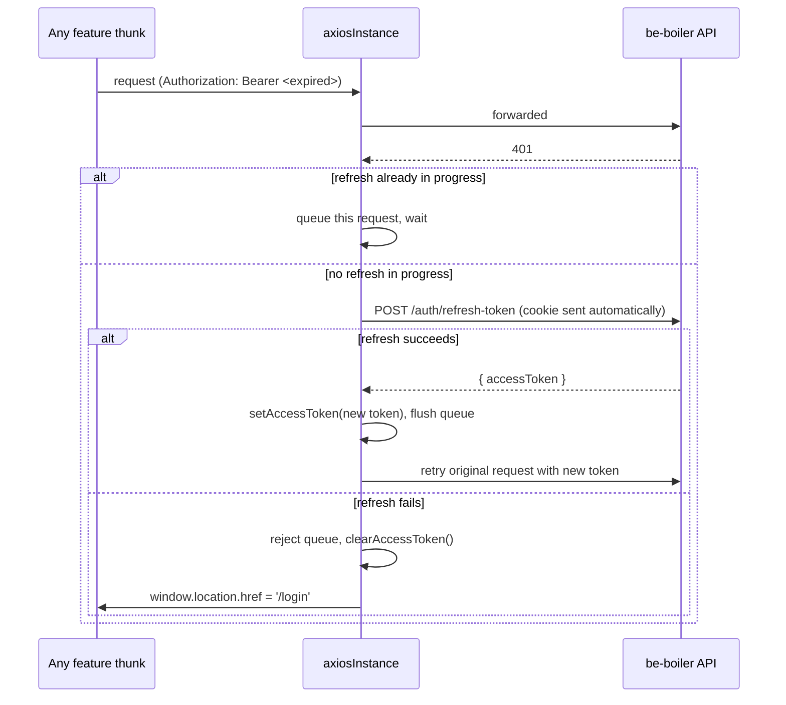

# Authentication Flow

## The two-token model, from the client's side

be-boiler issues an access/refresh token pair on login (see the `be-boiler` repo's own
`docs/authentication-flow.md` for the server-side half — token rotation, reuse detection, cookie
options). This app only ever handles half of that pair directly:

| | Access token | Refresh token |
|---|---|---|
| Where it lives | `localStorage`, key `erp_access_token` | httpOnly cookie set by the backend — never touched by JS |
| Who reads it | `src/services/interceptors.ts` (`getAccessToken`) | the browser, automatically, via `withCredentials` |
| How it's used | `Authorization: Bearer <token>` header on every request | attached automatically to `POST /auth/refresh-token` and `POST /auth/logout` (cookie `path` is scoped to `/api/v1/auth/*` on the backend) |

Because the refresh token is httpOnly, there is no frontend code path that can read, store, or
forward it — `loginApi`/`refreshTokenApi` (`src/features/auth/authApi.ts`) never see it in the
response body, only `accessToken`. This is deliberate: it closes off the main XSS token-theft
vector, at the cost of the access token itself living in `localStorage`, which *is* readable by
any script running on the page. The tradeoff is accepted here rather than moving the access token
to another httpOnly cookie, since the access token is short-lived and doing so would need CSRF
protection on every authenticated GET.

## Login

`LoginPage` (`src/pages/Login/LoginPage.tsx`) is a `react-hook-form` + `yup` form that dispatches
`login` (`src/features/auth/authThunk.ts`) on submit:

```
LoginPage.onSubmit
  → dispatch(login({ email, password }))
    → loginApi()                                   POST /auth/login
    → setAccessToken(response.data.accessToken)     localStorage
  → authSlice sets isAuthenticated, user, permissions, roles
  → navigate(from ?? '/dashboard', { replace: true })
```

`permissions`/`roles` on the Redux user object are **not** returned by the backend — be-boiler
authorizes purely by role string (`admin`/`manager`/`cashier`) and never sends a permissions
array. `authSlice.ts` derives them client-side via `getPermissionsForRole` (see
`src/utils/rolePermissions.ts`), a hand-maintained mirror of what each backend route actually
allows. This map is what the permission system described in
[architecture.md](./architecture.md) reads from — keeping the two in sync is a manual
responsibility, not something enforced by types.

`from` is read off `location.state`, populated by `ProtectedRoute` when it redirects an
unauthenticated visit — so logging in returns the user to the page they originally asked for
rather than always dropping them on `/dashboard`.

There is no signup page and no `POST /auth/signup` call anywhere in this codebase — matching the
backend, which only creates accounts via `npm run seed:admin` (the first admin) or `POST /staff`
(every account after that, admin-only). If a signup flow is ever wanted here, there's no backend
route to call yet.

## Session restore on page load

Because the access token lives in `localStorage` and Redux state resets on every page load,
refreshing the browser would otherwise always show a logged-out app even with a valid session.
`AuthInitializer` in `src/App.tsx` runs once at startup, before routes render:

```
token = getAccessToken()
if (token)  → dispatch(getCurrentUser())     GET /users/me  → repopulates user/permissions
else        → dispatch(setInitialized())     nothing to restore, stop "initializing"
```

`getCurrentUser` (`src/features/auth/authThunk.ts`) clears the stored access token if the call
fails (e.g. the access token expired *and* the refresh cookie is also gone/expired), so a
transient failure doesn't leave the app in a stuck logged-in-looking-but-broken state.

`state.auth.initializing` exists specifically to cover the gap between "app just loaded" and
"we've confirmed whether the stored token is still good" — see [ProtectedRoute](#protectedroute-gating-access)
below for why that matters.

## The axios interceptor: 401 → refresh → retry

`src/services/interceptors.ts` wires two interceptors onto the shared `axiosInstance`
(`src/services/axios.ts`), installed once via `setupInterceptors()` at app startup:

- **Request interceptor** — attaches `Authorization: Bearer <token>` if `getAccessToken()`
  returns one; silently skipped for public endpoints (there aren't many — most of this app's API
  surface requires auth).
- **Response interceptor** — on any `401`, attempts exactly one silent refresh-and-retry before
  giving up:



Two details worth calling out because they're easy to get wrong when copying this pattern
elsewhere:

- **The `_retry` flag and the `/auth/refresh-token` URL check** (`interceptors.ts`) both exist to
  stop the interceptor from retrying forever — without `_retry`, a request that gets a 401 *again*
  after a "successful" refresh would loop; without excluding the refresh call itself, a 401 from
  `/auth/refresh-token` would try to refresh the refresh call.
- **The request queue** (`isRefreshing` / `failedQueue`) exists because a page can fire several
  requests in parallel (e.g. the Dashboard's staff + inventory fetches). Without it, each would
  independently see the 401 and race to call `/auth/refresh-token`, and since be-boiler's refresh
  tokens are single-use with reuse-detection (see the backend doc), the *second* concurrent
  refresh call would look like token theft and revoke every session for that user. Queuing
  guarantees only one refresh call happens at a time; the rest wait for it and reuse its result.
- **The redirect on refresh failure uses `window.location.href`, not `useNavigate`** — the
  interceptor module has no access to a component tree or router context, and `window.location`
  works from anywhere at the cost of a full page reload instead of a client-side navigation.

## Logout

`logout` (`src/features/auth/authThunk.ts`) calls `POST /auth/logout` (which revokes just the
current refresh token server-side, per the backend's docs) and then unconditionally clears the
local access token in a `finally` block — so even if the network call fails, the frontend still
forgets the token and `authSlice` resets to its logged-out `initialState`. This matches the
backend's choice to only revoke the one session on logout: closing the tab (or the request
failing outright) still leaves the browser holding a dead access token, and this cleanup ensures
that isn't mistaken for a valid one.

## ProtectedRoute — gating access

`src/routes/ProtectedRoute.tsx` wraps every authenticated route (wired in
`src/routes/AppRoutes.tsx`, alongside the permission-level gating covered in
[architecture.md](./architecture.md)):

```
initializing === true   → render a full-screen loading overlay, nothing else
isAuthenticated === false → <Navigate to="/login" state={{ from: location }} />
otherwise                 → render the protected content
```

The `initializing` check exists to cover exactly the window described above under "Session
restore on page load" — without it, a hard refresh on any protected page would flash a redirect
to `/login` (because Redux state resets to `isAuthenticated: false` on reload) before
`getCurrentUser()` has had a chance to confirm the session is actually still valid.

`AppRoutes.tsx` renders `/login` as the only public route; every other path — including the
catch-all `*` — either resolves inside `ProtectedRoute` or redirects to `/dashboard`, so there is
no route in this app reachable without a session.

## Where each piece lives

| Concern | File |
|---|---|
| Login/logout/session-restore business logic | `src/features/auth/authThunk.ts` |
| Auth Redux state shape + reducers | `src/features/auth/authSlice.ts` |
| Raw HTTP calls to `/auth/*` and `/users/me` | `src/features/auth/authApi.ts` |
| Frontend-shaped types mirroring be-boiler's `User` model | `src/features/auth/authTypes.ts` |
| Access token storage + request/response interceptors | `src/services/interceptors.ts` |
| Shared axios instance (`withCredentials`, base URL) | `src/services/axios.ts` |
| Role → permission derivation (client-side mirror of backend RBAC) | `src/utils/rolePermissions.ts` |
| Session bootstrap on page load | `src/App.tsx` (`AuthInitializer`) |
| Login form | `src/pages/Login/LoginPage.tsx` |
| Auth gate for protected routes | `src/routes/ProtectedRoute.tsx` |
| Permission gate for individual routes | `src/routes/PermissionRoute.tsx` (see [architecture.md](./architecture.md)) |

## Related docs

- [user-and-maintenance.md](./user-and-maintenance.md) — the Users and MaintenanceLogs features, including how their access gating relies on the permission map above.
- [architecture.md](./architecture.md) — the permission-route system and overall frontend layering.
